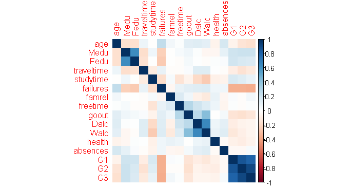
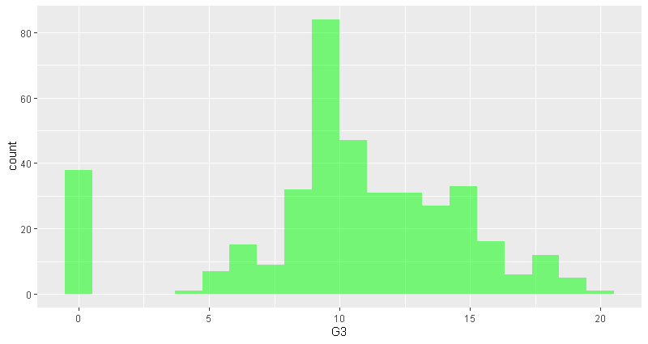
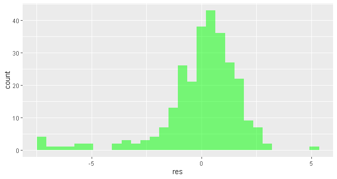
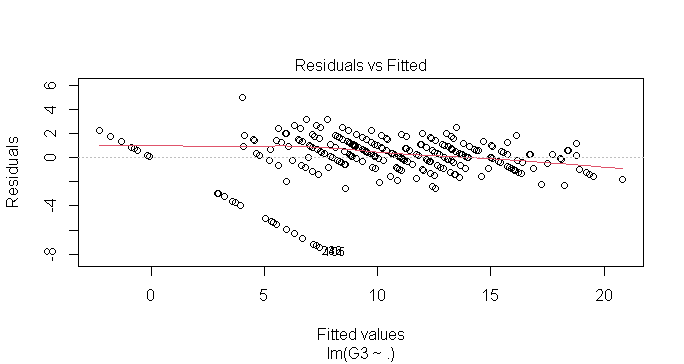
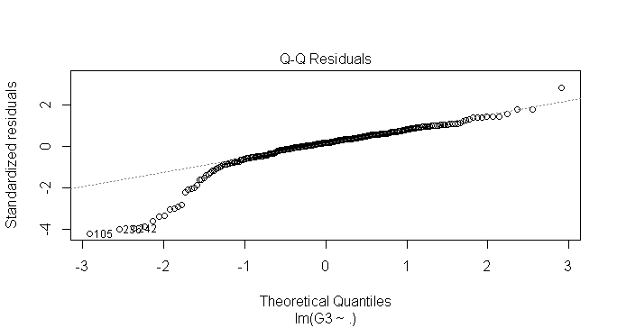
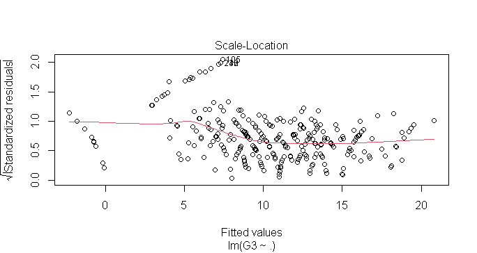
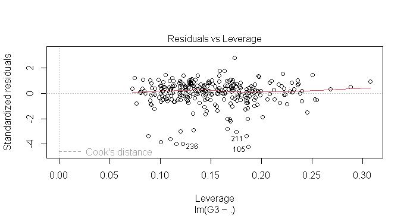
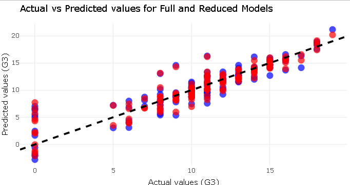
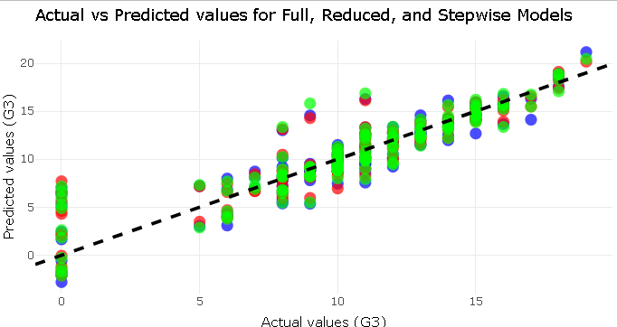

# Student Final Grade Prediction

## Overview
This project aims to predict the final grade (`G3`) of students using the UCI Student Performance dataset. A regression model was developed, and extensive exploratory data analysis (EDA), feature selection, and model evaluation were performed. Visualizations and comparisons between different models highlight the most effective approach.

---

## Dataset

### Source
The dataset is obtained from the [UCI Machine Learning Repository](https://archive.ics.uci.edu/ml/datasets/Student+Performance).

### Description
The dataset includes 33 attributes related to student demographics, academic performance, and social factors, with the final grade (`G3`) as the target variable.

- **Instances:** 395
- **Features:** 33
- **Target Variable:** `G3` (Final Grade)
- **Key Features:**
  - Academic Performance: `G1` (1st Period Grade), `G2` (2nd Period Grade), `absences`
  - Demographics: `age`, `gender`, `address`
  - Social: `famrel` (Family Relationships), `famsize`

---

## Methodology

### Exploratory Data Analysis (EDA)
1. **Correlation Analysis:**
   - A correlation matrix was plotted to identify relationships between numeric variables.
   - Features strongly correlated with `G3` were highlighted for further modeling.
   ```r
   # Correlation matrix
   num.cols <- sapply(dt, is.numeric)
   cor.data <- cor(dt[, ..num.cols])
   corrplot(cor.data, method = "color")
   ```

2. **Target Variable Distribution:**
   - Histogram of `G3` revealed a significant number of students scoring zero or near the maximum, suggesting possible grading patterns.
   ```r
   ggplot(dt, aes(x = G3)) +
     geom_histogram(bins = 20, alpha = 0.5, fill = "green") +
     labs(title = "Distribution of Final Grades (G3)", x = "Final Grade (G3)", y = "Frequency")
   ```

3. **Visualization Techniques:**
   - Scatter plots, histograms, and advanced visualizations were used to explore data patterns.
   - Analysis of categorical features like `school` and `address` was performed to identify patterns.

---

### Data Preprocessing
1. **Data Cleaning:**
   - Handled missing values and removed redundant or irrelevant features.

2. **Data Splitting:**
   - Data was split into training (70%) and testing (30%) sets using random sampling for reproducibility.
   ```r
   set.seed(101)
   sample <- sample.split(dt$G3, SplitRatio = 0.7)
   train <- subset(dt, sample == TRUE)
   test <- subset(dt, sample == FALSE)
   ```

3. **Feature Engineering:**
   - Identified and retained significant predictors using manual selection and stepwise regression techniques.
   - Encoded categorical variables using one-hot encoding.

4. **Standardization:**
   - Standardized numeric variables to ensure consistent scaling across features.

---

### Modeling

#### 1. Full Model
A linear regression model was built using all features as predictors.
```r
model_full <- lm(G3 ~ ., data = train)
summary(model_full)
```

- **Strengths:** Comprehensive analysis of all variables.
- **Weaknesses:** Increased complexity and overfitting potential.

#### 2. Reduced Model
A reduced model was developed by selecting significant predictors (`absences`, `G2`, `age`, `famrel`, `G1`).
```r
model_reduced <- lm(G3 ~ absences + G2 + age + famrel + G1, data = train)
summary(model_reduced)
```

- **Strengths:** Simplified model with fewer predictors.
- **Weaknesses:** Potential exclusion of valuable predictors.

#### 3. Stepwise Regression Model
Stepwise regression (combining forward and backward selection) was performed to identify the optimal subset of predictors.
```r
model_stepwise <- step(lm(G3 ~ ., data = train), direction = "both", trace = 0)
summary(model_stepwise)
```

- **Strengths:** Automated feature selection balances simplicity and performance.
- **Weaknesses:** Relies on statistical heuristics which might not capture domain-specific insights.

---

### Model Evaluation

Models were compared based on the following metrics:

- **Mean Squared Error (MSE):** Measures average squared difference between actual and predicted values.
- **Root Mean Squared Error (RMSE):** Square root of MSE.
- **R-squared (R²):** Proportion of variance in `G3` explained by the model.
- **Residual Analysis:** Checked the distribution of residuals to validate model assumptions.
- **ANOVA:** Used to compare nested models and validate reduced model assumptions.

Evaluation metrics were computed using the following function:
```r
compute_metrics <- function(model, data, actual_col) {
  predicted <- predict(model, data)
  actual <- data[[actual_col]]
  MSE <- mean((actual - predicted)^2)
  RMSE <- sqrt(MSE)
  SSE <- sum((predicted - actual)^2)
  SST <- sum((mean(data[[actual_col]]) - actual)^2)
  R2 <- 1 - SSE / SST
  return(list(MSE = MSE, RMSE = RMSE, R2 = R2))
}
```

---

## Results

| Model        | MSE        | RMSE       | R²        |
|--------------|------------|------------|------------|
| Full Model   |  4.123811  |  2.030717  | 0.7979743  |
| Reduced Model|  3.475719  |  1.864328  | 0.8297244  |
| Stepwise     |  3.940424  |  1.985050  | 0.8069585  |

- The **reduced model** achieved similar performance to the full model, making it preferable for simplicity.
- The **stepwise model** provided the best balance of accuracy and simplicity.

---

## Visualizations

### Correlation Matrix


### Distribution of Final Grades


### Residual Analysis
- **Residual Distribution:**
  
- **Residuals vs Fitted Values:**
  
- **Normal Q-Q Plot:**
  
- **Scale-Location Plot:**
  
- **Residuals vs Leverage:**
  

### Actual vs Predicted Values
- **Full vs Reduced Model:**
  
- **Comparison of All Models:**
  
```r
# Visualizing Actual vs Predicted Values
pldf <- data.frame(
  predicted_full = predict(model_full, test),
  predicted_red = predict(model_reduced, test),
  predicted_stepwise = predict(model_stepwise, test),
  actual = test$G3
)

ggplot(pldf) +
  geom_point(aes(x = actual, y = predicted_full), color = "blue", size = 3, alpha = 0.7) +
  geom_point(aes(x = actual, y = predicted_red), color = "red", size = 3, alpha = 0.7) +
  geom_point(aes(x = actual, y = predicted_stepwise), color = "green", size = 3, alpha = 0.7) +
  geom_abline(slope = 1, intercept = 0, linetype = "dashed", color = "black", size = 1) +
  labs(
    title = "Actual vs Predicted Values",
    x = "Actual Values (G3)",
    y = "Predicted Values (G3)"
  ) +
  theme_minimal()
```

---

## Conclusion

The project successfully predicts student grades using regression models. Key insights include:

- Feature selection significantly impacts model simplicity and interpretability.
- Reduced and stepwise models are viable alternatives to full models, offering similar performance with reduced complexity.
- Residual analysis confirms that model assumptions were reasonably met.

### Future Work
- Explore non-linear models such as Random Forest or Gradient Boosting.
- Incorporate domain knowledge for feature engineering.
- Expand the dataset for more robust analysis.
- Investigate external factors like teacher performance or classroom size.

---

## Setup Instructions

### Prerequisites
- **R** installed on your system.
- Required packages: `data.table`, `ggplot2`, `plotly`, `dplyr`, `ggthemes`, `corrplot`, `caTools`, `knitr`, `kableExtra`.

### Installation
1. Clone this repository:
   ```bash
   git clone https://github.com/yourusername/student-grade-prediction.git
   cd student-grade-prediction
   ```
2. Install dependencies in R:
   ```r
   install.packages(c("data.table", "ggplot2", "plotly", "dplyr", "ggthemes", "corrplot", "caTools", "knitr", "kableExtra"))
   ```

### Usage
1. Place the dataset (`student-mat.csv`) in the project directory.
2. Run the analysis script:
   ```r
   source("analysis.R")
   ```
3. Visualizations and results will be displayed.

---

## License
This project is licensed under the [MIT License](LICENSE).

---

## Contact
- **Name:** Shaurya Sethi
- **Email:** shauryaswapansethi@gmail.com

Feel free to contribute or provide feedback!
